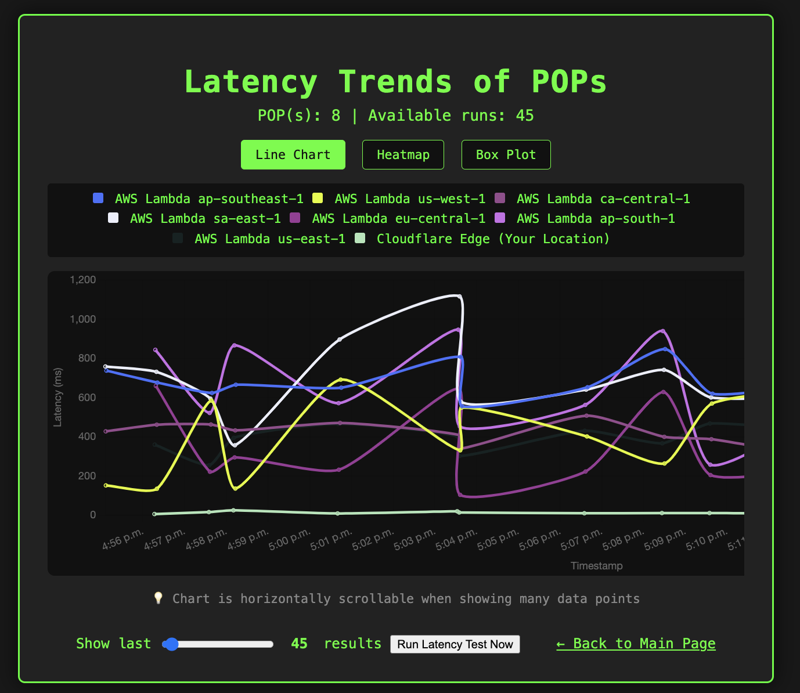
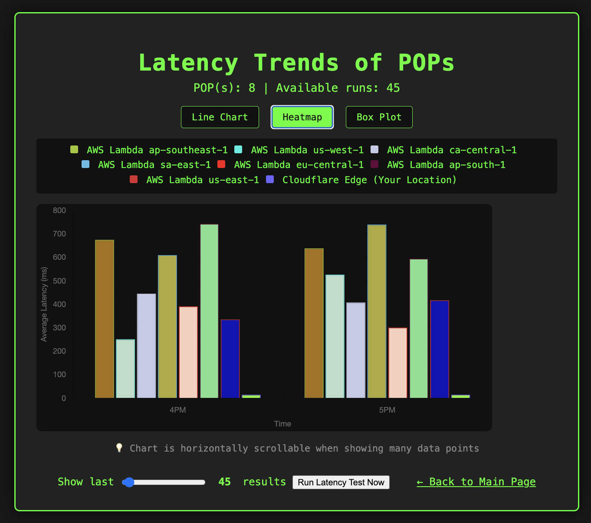
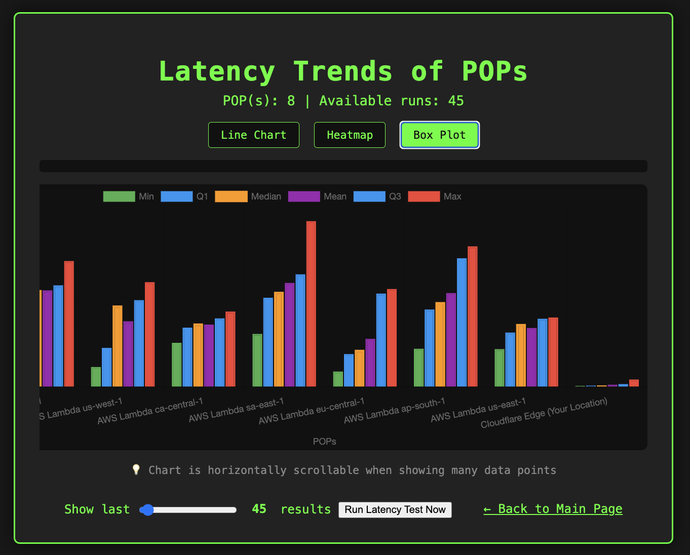

# What's My Latency?

**What's My Latency?** is a web app and Cloudflare Worker project that measures your real-time latency to multiple edge locations around the world. Instantly see which region is fastest for you, visualized in a beautiful, interactive UI with historical trends.

---

## 🚀 Live Demo

👉 [Try What's My Latency on Cloudflare Pages!](https://whats-my-latency.pages.dev/)

📈 [View Latency Trends](https://whats-my-latency.pages.dev/trends.html)

## ✨ Features

- **Real-time latency measurement** to Cloudflare and AWS Lambda regions worldwide
- **Interactive map** with animated "WarGames"-style lines from each region to your location
- **Terminal-inspired UI** with region table, country flags, and full region names
- **Winner display**: See the fastest region above the map after each test
- **Theme toggle**: Matrix, Classic, and Light themes with persistent selection
- **Accessibility**: Keyboard navigation, ARIA labels, focus indicators, and color contrast
- **Error handling & feedback**: Loading spinner, error messages, and user notifications
- **"Center on Me"**: Instantly center the map on your location
- **Responsive design**: Works great on desktop, tablet, and mobile
- **Cloudflare Turnstile**: Privacy-first, user-friendly CAPTCHA to protect stats submission from bots and abuse
- **Automatic CI/CD:** Every push to GitHub automatically deploys the latest version to Cloudflare Pages, ensuring the [live demo](https://whats-my-latency.pages.dev/) is always up to date.
- **Automatic backend latency testing:** The backend runs latency tests to all regions every 3 minutes using Cloudflare Workers Cron Triggers.
- **D1 database storage:** All latency results are stored in Cloudflare D1 for historical analysis.
- **Interactive latency trends:** Scrollable chart showing historical latency data across all POPs with configurable time range (10-1000+ data points)
- **Multiple chart types:** Line chart, heatmap, and statistical box plot for different data perspectives
- **Custom legend:** Always-visible legend showing all POPs with color coding
- **Real-time data updates:** "Run Latency Test Now" button triggers new tests and updates the chart
- **Smart validation:** Slider automatically adjusts to available data range
- **Statistical analysis:** Box plot shows min, Q1, median, mean, Q3, and max latency for each POP

---

## 🌍 Why Cloudflare?

This project is a hands-on demonstration of Cloudflare's global edge network and developer platform:

- **Global Reach:** Instantly test latency to Cloudflare POPs and AWS regions around the world, showing the power of a distributed edge.
- **Real-Time Performance:** Experience how Cloudflare Workers deliver lightning-fast responses from the nearest location.
- **Developer Platform:** Built using Cloudflare Workers, this app highlights how easy it is to deploy, scale, and run code at the edge with minimal setup.
- **Interoperability:** Combines Cloudflare and AWS endpoints, showing how Cloudflare can be part of a multi-cloud or hybrid architecture.
- **Modern Web Standards:** Uses Cloudflare's support for modern JavaScript, APIs, and security best practices.
- **User Experience:** Demonstrates how Cloudflare's edge can power interactive, real-time, and globally accessible web apps.
- **Security & Bot Protection:** Uses Cloudflare Turnstile for privacy-first, user-friendly CAPTCHA to protect endpoints from bots and abuse, showcasing Cloudflare's security platform.

> **Cloudflare isn't just a CDN—it's a platform for building the next generation of fast, secure, and global applications.**

---

## 🚀 How It Works

- The backend is a Cloudflare Worker (and AWS Lambda endpoints) that returns its POP/location and timestamp in a JSON response.
- The frontend makes parallel requests to all endpoints, measures roundtrip times, and displays results in a table and on a map.
- The map animates lines from each region to your location, just like in classic "WarGames" movies.
- Click or keyboard-activate any region marker to replay the animation for that region.
- Historical data is stored in Cloudflare D1 and visualized in an interactive, scrollable chart.

---

## 🖥️ Running the App Locally

1. **Install [Node.js and npx](https://nodejs.org/)** if you haven't already.
2. From the project root, run:
   ```sh
   npx serve frontend
   ```
3. Open [http://localhost:3000](http://localhost:3000) in your browser.

**Troubleshooting:**
- If port 3000 is in use, try a different port:
  ```sh
  npx serve frontend -l 8080
  ```
  Then open [http://localhost:8080](http://localhost:8080).
- Leave the terminal window open while testing; closing it will stop the server.

---

## 🕹️ Using the App

### Main Page
- The app will immediately test latency to all regions and display results in the table and on the map.
- **Re-Test**: Click the "Re-Test" button to run the tests again.
- **Theme Toggle**: Switch between Matrix, Classic, and Light themes (your choice is remembered).
- **Map**: See all regions, your location, and animated lines. Click or keyboard-activate any marker to replay the animation for that region.
- **Center on Me**: Click to center the map on your location.
- **Winner**: The fastest region is shown above the map after each test.
- **Accessibility**: All features are keyboard accessible and screen reader friendly.
- **Error Handling**: If a region can't be reached, you'll see a clear error message and icon in the table.

### Trends Page
- **Multiple Chart Types**: 
  - **Line Chart**: Shows latency trends over time for each POP
  - **Heatmap**: Shows average latency by hour for each POP
  - **Box Plot**: Shows statistical distribution (min, Q1, median, mean, Q3, max) for each POP
- **Configurable Range**: Use the slider to select 10-1000+ data points to display
- **Real-time Updates**: Click "Run Latency Test Now" to trigger new tests and refresh the chart
- **Custom Legend**: Always-visible legend showing all POPs with color coding
- **Smart Validation**: Slider automatically adjusts to available data range
- **Loading Feedback**: Visual spinner during data loading and chart updates
- **Statistical Insights**: Box plot provides comprehensive latency distribution analysis

---

## 📦 Directory Structure

- `cloudflare-worker/` — Cloudflare Worker backend and deployment config
- `frontend/` — Frontend UI (HTML, CSS, JS)
- (root) — Documentation

---

## 🛠️ Backend API Example

A typical response from the Worker or Lambda endpoint:
```json
{
  "pop": "SFO",
  "timestamp": "2024-06-10T18:00:00Z",
  "cf_ray": "7a1b2c3d4e5f1234-SFO",
  "country": "US"
}
```
- `pop`: The edge location that handled your request (e.g., SFO, LHR)
- `timestamp`: The UTC time the request was processed
- `cf_ray`: The Cloudflare Ray ID (includes POP code)
- `country`: The detected country code

---

## 📚 API Reference: Cloudflare Worker Endpoints

### `GET /`

Returns the POP (Point of Presence) and related info for the Cloudflare Worker handling your request.

**Endpoint:**
```
https://whats-my-latency-worker.<your-subdomain>.workers.dev/
```

**Method:**
- `GET`

**Query Parameters:**
- None

**Response:**
- `200 OK` — JSON object

```json
{
  "pop": "SFO",
  "timestamp": "2024-06-10T18:00:00Z",
  "cf_ray": "7a1b2c3d4e5f1234-SFO",
  "country": "US"
}
```

| Field      | Type   | Description                                      |
|------------|--------|--------------------------------------------------|
| pop        | string | Cloudflare POP code (e.g., SFO, LHR)             |
| timestamp  | string | UTC ISO timestamp of the request                 |
| cf_ray     | string | Cloudflare Ray ID (includes POP code)            |
| country    | string | ISO country code of the detected location        |

**Example:**
```
curl https://whats-my-latency-worker.<your-subdomain>.workers.dev/
```

### `GET /trends`

Returns latency test results for visualization in the frontend trends chart.

**Query Parameters:**
- `limit` (optional): Number of results to return (10-1000, default: 100)

**Example:**
```
curl https://whats-my-latency-worker.<your-subdomain>.workers.dev/trends?limit=200
```

### `GET /trends-count`

Returns the count of unique POPs (regions) available in the database.

**Example:**
```
curl https://whats-my-latency-worker.<your-subdomain>.workers.dev/trends-count
```

### `GET /trends-data-count`

Returns the count of unique test runs available in the database.

**Example:**
```
curl https://whats-my-latency-worker.<your-subdomain>.workers.dev/trends-data-count
```

### `POST /trigger-latency-test`

Manually triggers a new latency test to all regions and returns the results.

**Example:**
```
curl -X POST https://whats-my-latency-worker.<your-subdomain>.workers.dev/trigger-latency-test
```

---

## 🧑‍💻 Accessibility & Responsiveness

- All interactive elements are keyboard accessible and have ARIA labels.
- Visible focus indicators for keyboard navigation.
- Sufficient color contrast for all themes.
- Fully responsive layout for mobile, tablet, and desktop.
- Chart is horizontally scrollable for large datasets.

---

## 📝 Project Phases

### Phase 1 (Complete)
- Cloudflare Worker backend that returns POP, timestamp, and related info
- Setup and deployment instructions

### Phase 2 (Complete)
- Frontend UI with table, map, leaderboard, and full accessibility
- Multi-region latency testing (Cloudflare + AWS Lambda)
- Animated map visualization and interactive features
- Error handling, user feedback, and theme support

### Phase 3 (Complete)
- Historical data storage in Cloudflare D1
- Interactive trends chart with scrollable visualization
- Multiple chart types (line, heatmap, box plot) for comprehensive data analysis
- Real-time data updates and configurable time ranges
- Enhanced UX with custom legends and smart validation
- Statistical analysis with comprehensive latency distribution insights

---

## 📷 Screenshots

### Main Page


### Trends Page - Chart Types

#### Line Chart
Shows latency trends over time for each POP:


#### Heatmap
Shows average latency by hour for each POP:


#### Box Plot
Shows statistical distribution (min, Q1, median, mean, Q3, max) for each POP:


> **Tip:**
> - Screenshots are stored in the `frontend/screenshots/` directory.
> - Use PNG or JPG format for best results.
> - To update, replace the images with your own screenshots.

---

## 📝 TODO

- [ ] Set up a custom branded domain for the Cloudflare Pages site (e.g., whatmylatency.com or latency.yourbrand.com)

---

**Enjoy measuring your latency around the world!** 

---

## 🛡️ Cloudflare Turnstile Integration

This project uses [Cloudflare Turnstile](https://developers.cloudflare.com/turnstile/) to protect the stats submission endpoint from abuse and bots.

### How to Set Up Turnstile

1. **Register your site** in the [Cloudflare Turnstile dashboard](https://dash.cloudflare.com/?to=/:account/turnstile) and get your **Site Key** and **Secret Key**.
2. **Frontend:**
   - In `frontend/index.html`, set your Site Key in the Turnstile widget:
     ```html
     <div class="cf-turnstile" data-sitekey="YOUR_SITE_KEY_HERE"></div>
     ```
   - (You have already set: `0x4AAAAAABlib5O3WAAktnD7`)
3. **Worker:**
   - In `cloudflare-worker/wrangler.toml`, add your Secret Key as an environment variable:
     ```toml
     [vars]
     TURNSTILE_SECRET_KEY = "YOUR_SECRET_KEY_HERE"
     ```
   - The Worker will use this to verify Turnstile tokens on the `/stats` endpoint.

**Note:** Never expose your Secret Key in frontend code or public repos.

--- 