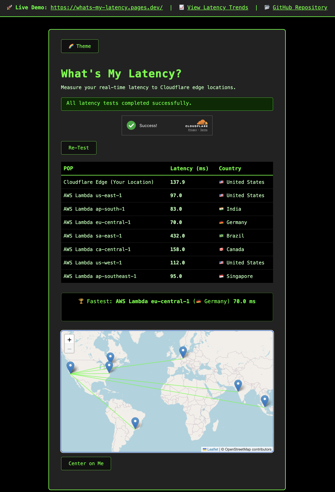

# What's My Latency?

**What's My Latency?** is a web app and Cloudflare Worker project that measures your real-time latency to multiple edge locations around the world. Instantly see which region is fastest for you, visualized in a beautiful, interactive UI.

---

## ✨ Features

- **Real-time latency measurement** to Cloudflare and AWS Lambda regions worldwide
- **Interactive map** with animated "WarGames"-style lines from each region to your location
- **Terminal-inspired UI** with region table, country flags, and full region names
- **Winner display**: See the fastest region above the map after each test
- **Theme toggle**: Matrix, Classic, and Light themes with persistent selection
- **Accessibility**: Keyboard navigation, ARIA labels, focus indicators, and color contrast
- **Error handling & feedback**: Loading spinner, error messages, and user notifications
- **"Center on Me"**: Instantly center the map on your location
- **Responsive design**: Works great on desktop, tablet, and mobile

---

## 🌍 Why Cloudflare?

This project is a hands-on demonstration of Cloudflare’s global edge network and developer platform:

- **Global Reach:** Instantly test latency to Cloudflare POPs and AWS regions around the world, showing the power of a distributed edge.
- **Real-Time Performance:** Experience how Cloudflare Workers deliver lightning-fast responses from the nearest location.
- **Developer Platform:** Built using Cloudflare Workers, this app highlights how easy it is to deploy, scale, and run code at the edge with minimal setup.
- **Interoperability:** Combines Cloudflare and AWS endpoints, showing how Cloudflare can be part of a multi-cloud or hybrid architecture.
- **Modern Web Standards:** Uses Cloudflare’s support for modern JavaScript, APIs, and security best practices.
- **User Experience:** Demonstrates how Cloudflare’s edge can power interactive, real-time, and globally accessible web apps.

> **Cloudflare isn’t just a CDN—it’s a platform for building the next generation of fast, secure, and global applications.**

---

## 🚀 How It Works

- The backend is a Cloudflare Worker (and AWS Lambda endpoints) that returns its POP/location and timestamp in a JSON response.
- The frontend makes parallel requests to all endpoints, measures roundtrip times, and displays results in a table and on a map.
- The map animates lines from each region to your location, just like in classic "WarGames" movies.
- Click or keyboard-activate any region marker to replay the animation for that region.

---

## 🖥️ Running the App Locally

1. **Install [Node.js and npx](https://nodejs.org/)** if you haven't already.
2. From the project root, run:
   ```sh
   npx serve frontend
   ```
3. Open [http://localhost:3000](http://localhost:3000) in your browser.

**Troubleshooting:**
- If port 3000 is in use, try a different port:
  ```sh
  npx serve frontend -l 8080
  ```
  Then open [http://localhost:8080](http://localhost:8080).
- Leave the terminal window open while testing; closing it will stop the server.

---

## 🕹️ Using the App

- The app will immediately test latency to all regions and display results in the table and on the map.
- **Re-Test**: Click the "Re-Test" button to run the tests again.
- **Theme Toggle**: Switch between Matrix, Classic, and Light themes (your choice is remembered).
- **Map**: See all regions, your location, and animated lines. Click or keyboard-activate any marker to replay the animation for that region.
- **Center on Me**: Click to center the map on your location.
- **Winner**: The fastest region is shown above the map after each test.
- **Accessibility**: All features are keyboard accessible and screen reader friendly.
- **Error Handling**: If a region can't be reached, you'll see a clear error message and icon in the table.

---

## 📦 Directory Structure

- `cloudflare-worker/` — Cloudflare Worker backend and deployment config
- `frontend/` — Frontend UI (HTML, CSS, JS)
- (root) — Documentation

---

## 🛠️ Backend API Example

A typical response from the Worker or Lambda endpoint:
```json
{
  "pop": "SFO",
  "timestamp": "2024-06-10T18:00:00Z",
  "cf_ray": "7a1b2c3d4e5f1234-SFO",
  "country": "US"
}
```
- `pop`: The edge location that handled your request (e.g., SFO, LHR)
- `timestamp`: The UTC time the request was processed
- `cf_ray`: The Cloudflare Ray ID (includes POP code)
- `country`: The detected country code

---

## 📚 API Reference: Cloudflare Worker Endpoint

### `GET /`

Returns the POP (Point of Presence) and related info for the Cloudflare Worker handling your request.

**Endpoint:**
```
https://whats-my-latency-worker.<your-subdomain>.workers.dev/
```

**Method:**
- `GET`

**Query Parameters:**
- None

**Response:**
- `200 OK` — JSON object

```json
{
  "pop": "SFO",
  "timestamp": "2024-06-10T18:00:00Z",
  "cf_ray": "7a1b2c3d4e5f1234-SFO",
  "country": "US"
}
```

| Field      | Type   | Description                                      |
|------------|--------|--------------------------------------------------|
| pop        | string | Cloudflare POP code (e.g., SFO, LHR)             |
| timestamp  | string | UTC ISO timestamp of the request                 |
| cf_ray     | string | Cloudflare Ray ID (includes POP code)            |
| country    | string | ISO country code of the detected location        |

**Example:**
```
curl https://whats-my-latency-worker.<your-subdomain>.workers.dev/
```

---

## 🧑‍💻 Accessibility & Responsiveness

- All interactive elements are keyboard accessible and have ARIA labels.
- Visible focus indicators for keyboard navigation.
- Sufficient color contrast for all themes.
- Fully responsive layout for mobile, tablet, and desktop.

---

## 📝 Project Phases

### Phase 1 (Complete)
- Cloudflare Worker backend that returns POP, timestamp, and related info
- Setup and deployment instructions

### Phase 2 (Complete)
- Frontend UI with table, map, leaderboard, and full accessibility
- Multi-region latency testing (Cloudflare + AWS Lambda)
- Animated map visualization and interactive features
- Error handling, user feedback, and theme support

---

## 📷 Screenshots

Below is a screenshot of the main page:



> **Tip:**
> - Place your screenshot in the `frontend/screenshots/` directory as `main-ui.png`.
> - Use PNG or JPG format for best results.
> - To update, replace the placeholder image with your own screenshot.

---

**Enjoy measuring your latency around the world!** 